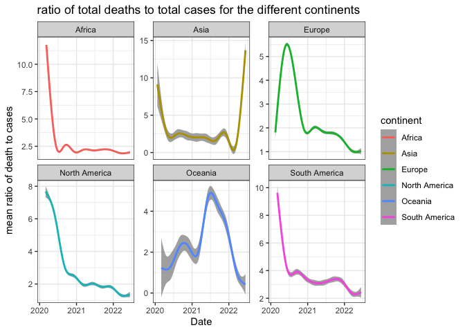
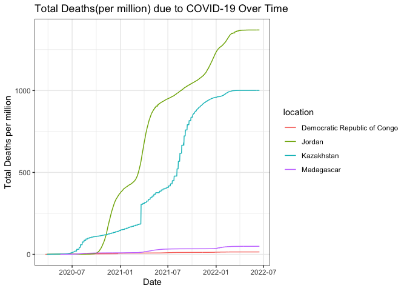
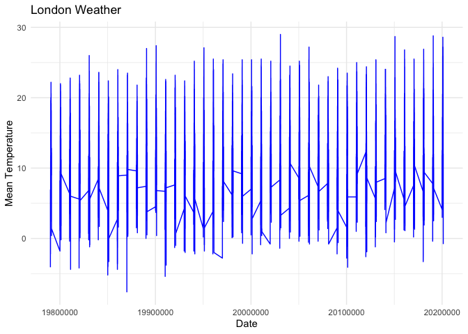
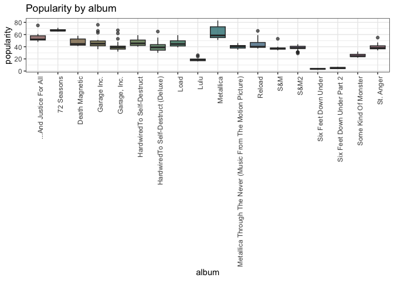

# Question 1

``` r
library(tidyverse)
```

    ## ── Attaching packages ─────────────────────────────────────── tidyverse 1.3.1 ──

    ## ✔ ggplot2 3.4.0     ✔ purrr   1.0.1
    ## ✔ tibble  3.2.1     ✔ dplyr   1.1.2
    ## ✔ tidyr   1.3.0     ✔ stringr 1.5.0
    ## ✔ readr   2.1.4     ✔ forcats 0.5.1

    ## ── Conflicts ────────────────────────────────────────── tidyverse_conflicts() ──
    ## ✖ dplyr::filter() masks stats::filter()
    ## ✖ dplyr::lag()    masks stats::lag()

``` r
Loc <- "Question1/data/Covid/"
suppressMessages({Covid1 <- read_csv(glue::glue("{Loc}owid-covid-data.csv"))})
list.files('Question1/code/', full.names = T, recursive = T) %>% .[grepl('.R', .)] %>% as.list() %>% walk(~source(.))
```

    ## `summarise()` has grouped output by 'location'. You can override using the
    ## `.groups` argument.

    ## # A tibble: 4 × 2
    ##   location                     avg_poverty
    ##   <chr>                              <dbl>
    ## 1 Jordan                               0.1
    ## 2 Kazakhstan                           0.1
    ## 3 Madagascar                          77.6
    ## 4 Democratic Republic of Congo        77.1

``` r
l <- line_bar(alpha = 0.8, size = 1,fig.width=6, fig.height=4)
```

    ## `geom_smooth()` using method = 'gam' and formula = 'y ~ s(x, bs = "cs")'



With regards to see differing trends between Africa and other countries

``` r
library(tidyverse)

Loc <- "Question1/data/Covid/"
suppressMessages({Covid1 <- read_csv(glue::glue("{Loc}owid-covid-data.csv"))})
list.files('Question1/code/', full.names = T, recursive = T) %>% .[grepl('.R', .)] %>% as.list() %>% walk(~source(.))
```

    ## `summarise()` has grouped output by 'location'. You can override using the
    ## `.groups` argument.

    ## # A tibble: 4 × 2
    ##   location                     avg_poverty
    ##   <chr>                              <dbl>
    ## 1 Jordan                               0.1
    ## 2 Kazakhstan                           0.1
    ## 3 Madagascar                          77.6
    ## 4 Democratic Republic of Congo        77.1

``` r
l1 <- top2_bottom2()
```

    ## `summarise()` has grouped output by 'location'. You can override using the
    ## `.groups` argument.

    ## # A tibble: 4 × 2
    ##   location                     avg_poverty
    ##   <chr>                              <dbl>
    ## 1 Jordan                               0.1
    ## 2 Kazakhstan                           0.1
    ## 3 Madagascar                          77.6
    ## 4 Democratic Republic of Congo        77.1

Now we now that Jordan and Kazakhstan on average have the least amount
of poverty, where as the Democratic republic of Congo and Madagascar
exhibit the highest level of poverty. Given this we can see how poverty
relates to the number of covid deaths. Perhaps surprisingly Jordan are
one of the countr

``` r
if(!require("tidyverse")) install.packages("tidyverse")
library(tidyverse)

Loc <- "Question1/data/Covid/"
suppressMessages({Covid1 <- read_csv(glue::glue("{Loc}owid-covid-data.csv"))})
list.files('Question1/code/', full.names = T, recursive = T) %>% .[grepl('.R', .)] %>% as.list() %>% walk(~source(.))
```

    ## `summarise()` has grouped output by 'location'. You can override using the
    ## `.groups` argument.

    ## # A tibble: 4 × 2
    ##   location                     avg_poverty
    ##   <chr>                              <dbl>
    ## 1 Jordan                               0.1
    ## 2 Kazakhstan                           0.1
    ## 3 Madagascar                          77.6
    ## 4 Democratic Republic of Congo        77.1

``` r
l2 <- Poverty_rates(alpha = 0.7)
```

    ## `summarise()` has grouped output by 'location'. You can override using the
    ## `.groups` argument.

``` r
l2
```

 The
following was done using the results from the above table and simply
graphing the total deaths (per million) using a geom_line function for
the respective countries. The results suggest that countries with higher
average poverty report far lower total deaths as compared to those with
lower levels of poverty. These results seems suspicious on surface
level. There is thus a need for futher investigation, perhaps less
reporting are done in ‘poorer’ countries or the reporting done is
faulty. Another approach would be an econometric analysis of the effect
of poverty on covid deaths which would shed light into whether these
relationships are subject to significant covariates that explains the
reason for the graph above.

# Question 2

``` r
library(tidyverse)


Loc1 <- "Question2/data/London/"
suppressMessages({London <- read_csv(glue::glue("{Loc1}london_weather.csv"))})
suppressMessages({UKMonthly_Detailed <- read_csv("~/21641412_Practical/Question2/data/London/UKMonthly_Detailed.csv")})
list.files('Question2/code/', full.names = T, recursive = T) %>% .[grepl('.R', .)] %>% as.list() %>% walk(~source(.))

s1 <- London_is_cold(alpha = 0.7)
s1
```


the idea here was to point out in a visually pleasing manner

``` r
library(tidyverse)


Loc1 <- "Question2/data/London/"
suppressMessages({London <- read_csv(glue::glue("{Loc1}london_weather.csv"))})
suppressMessages({UKMonthly_Detailed <- read_csv("~/21641412_Practical/Question2/data/London/UKMonthly_Detailed.csv")})
list.files('Question2/code/', full.names = T, recursive = T) %>% .[grepl('.R', .)] %>% as.list() %>% walk(~source(.))

s2 <- London_weather(alpha = 0.7)
s2
```



# Question 3

``` r
library(tidyverse)


Loc2 <- "Question3/data/Coldplay_vs_Metallica/"
suppressMessages({Spotify_info <- read_csv(glue::glue("{Loc2}Broader_Spotify_Info.csv"))})
suppressMessages({Coldplay <- read_csv(glue::glue("{Loc2}Coldplay.csv"))})
suppressMessages({metallica <- read_csv(glue::glue("{Loc2}metallica.csv"))})
```

here is the barplot

``` r
library(tidyverse)
Loc2 <- "Question3/data/Coldplay_vs_Metallica/"
suppressMessages({metallica <- read_csv(glue::glue("{Loc2}metallica.csv"))})
list.files('Question3/code/', full.names = T, recursive = T) %>% .[grepl('.R', .)] %>% as.list() %>% walk(~source(.))
f <- geom_bar1(alpha = 0.7, fig.width=6, fig.height= 20)
```

 The
following is found here

# Question 4

``` r
Loc3 <- "Question4/data/netflix/"
suppressMessages({credit<- read_csv(glue::glue("{Loc3}credits.csv"))})
suppressMessages({titles <- read_csv(glue::glue("{Loc3}titles.csv"))})

list.files('Question4/code/', full.names = T, recursive = T) %>% .[grepl('.R', .)] %>% as.list() %>% walk(~source(.))

m <- Movie_vs_series(alpha = 0.7,fig.width=6, fig.height=4)
m
```


This is why the following

``` r
Loc3 <- "Question4/data/netflix/"
suppressMessages({credit<- read_csv(glue::glue("{Loc3}credits.csv"))})
suppressMessages({titles <- read_csv(glue::glue("{Loc3}titles.csv"))})
list.files('Question4/code/', full.names = T, recursive = T) %>% .[grepl('.R', .)] %>% as.list() %>% walk(~source(.))

m2 <- table_of_extremes()
m2
```

    ##                Movies   Show    
    ## Above 7 rating 23.25086 49.53591
    ## Below 5 rating 10.18888 0

To extrapolate further on the possible benefit of focusing on shows as
oppose to movies is displayed in the table above. Filtering the
dataframe into only movies and shows respectively allows one to get the
percewntage of movies above a rating of 7 and below a rating of 5 (the
same for shows). This illustrates that shows exhibit an imdb rating of
higher than 7 almost 50% of the time. Furthermore, there are no show
with a rating under 5. Movies are typically more hit and miss.

Future analysis to be done could be to weigh how this obvious pro for
Shows relates to costs for producing shows vs movies (given shows are
longer one would expect a bigger budget required). This insight could
ultimately decide what to put more focus on.

# Question 5

``` r
library(tidyverse)


Loc4 <- "Question5/data/googleplay/"
suppressMessages({User_reviews<- read_csv(glue::glue("{Loc4}googleplaystore_user_reviews.csv"))})
suppressMessages({google_playstore <- read_csv(glue::glue("{Loc4}googleplaystore.csv"))})
```

First I made use of Geom_col in order to extract the most profitable
apps from different categories

``` r
library(tidyverse)


Loc4 <- "Question5/data/googleplay/"
suppressMessages({User_reviews<- read_csv(glue::glue("{Loc4}googleplaystore_user_reviews.csv"))})
suppressMessages({google_playstore <- read_csv(glue::glue("{Loc4}googleplaystore.csv"))})

list.files('Question5/code/', full.names = T, recursive = T) %>% .[grepl('.R', .)] %>% as.list() %>% walk(~source(.))

g <- profitability(alpha = 0.7)
```

 Here I
made use of the geom_col function to look at the most profitable
categories of apps.

``` r
list.files('Question5/code/', full.names = T, recursive = T) %>% .[grepl('.R', .)] %>% as.list() %>% walk(~source(.))

f <- size_summary(ignore.case = TRUE)
```

    ## # A tibble: 10 × 4
    ##    Category            avg_Size min_Size  max_Size
    ##    <chr>                  <dbl>    <dbl>     <dbl>
    ##  1 GAME               41188807.      1.1 100000000
    ##  2 FAMILY             25976275.      1   100000000
    ##  3 TRAVEL_AND_LOCAL   23028605.      1.9  90000000
    ##  4 SPORTS             22582327.      1.1 100000000
    ##  5 ENTERTAINMENT      21492959.      3.3  78000000
    ##  6 PARENTING          20111114.      1.5  98000000
    ##  7 FOOD_AND_DRINK     19377779.      1.7  76000000
    ##  8 HEALTH_AND_FITNESS 19239500.      1.2 100000000
    ##  9 EDUCATION          18066837.      1.2  97000000
    ## 10 AUTO_AND_VEHICLES  17921149.      1.1  97000000

Here we looked at the average size, minimum size and maximum size of the
apps given for the given categories. They are also rank ordered from
highest to lowest average size
