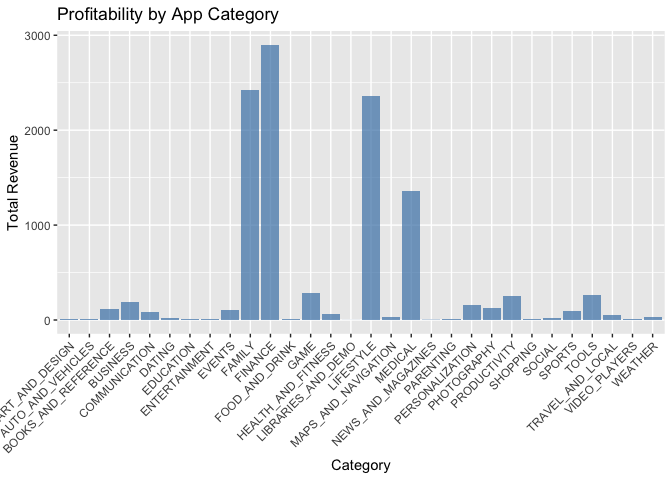

``` r
rm(list = ls()) # Clean your environment:
gc() # garbage collection - It can be useful to call gc after a large object has been removed, as this may prompt R to return memory to the operating system.
library(tidyverse)
```

# Question 1

crfr

# Question 2

``` r
if(!require("tidyverse")) install.packages("tidyverse")
library(tidyverse)


Loc1 <- "Question2/data/London/"
London <- read_csv(glue::glue("{Loc1}london_weather.csv"))
UKMonthly_Detailed <- read_csv("~/21641412_Practical/Question2/data/London/UKMonthly_Detailed.csv")
list.files('Question2/code/', full.names = T, recursive = T) %>% .[grepl('.R', .)] %>% as.list() %>% walk(~source(.))
```

er4f f4ff4

# Question 3

``` r
if(!require("tidyverse")) install.packages("tidyverse")
library(tidyverse)


Loc2 <- "Question3/data/Coldplay_vs_Metallica/"
Spotify_info <- read_csv(glue::glue("{Loc2}Broader_Spotify_Info.csv"))
Coldplay <- read_csv(glue::glue("{Loc2}Coldplay.csv"))
metallica <- read_csv(glue::glue("{Loc2}metallica.csv"))
```

here is the barplot

The following is found here

# Question 4

``` r
Loc3 <- "Question4/data/netflix/"
credit<- read_csv(glue::glue("{Loc3}credits.csv"))
titles <- read_csv(glue::glue("{Loc3}titles.csv"))
```

This is why the following

# Question 5

``` r
if(!require("tidyverse")) install.packages("tidyverse")
library(tidyverse)


Loc4 <- "Question5/data/googleplay/"
User_reviews<- read_csv(glue::glue("{Loc4}googleplaystore_user_reviews.csv"))
google_playstore <- read_csv(glue::glue("{Loc4}googleplaystore.csv"))
```

First I made use of Geom_col in order to extract the most profitable
apps from different categories

``` r
if(!require("tidyverse")) install.packages("tidyverse")
```

    ## Loading required package: tidyverse

    ## ── Attaching packages ─────────────────────────────────────── tidyverse 1.3.1 ──

    ## ✔ ggplot2 3.4.0     ✔ purrr   1.0.1
    ## ✔ tibble  3.2.1     ✔ dplyr   1.1.2
    ## ✔ tidyr   1.3.0     ✔ stringr 1.5.0
    ## ✔ readr   2.1.4     ✔ forcats 0.5.1

    ## ── Conflicts ────────────────────────────────────────── tidyverse_conflicts() ──
    ## ✖ dplyr::filter() masks stats::filter()
    ## ✖ dplyr::lag()    masks stats::lag()

``` r
library(tidyverse)


Loc4 <- "Question5/data/googleplay/"
User_reviews<- read_csv(glue::glue("{Loc4}googleplaystore_user_reviews.csv"))
```

    ## Rows: 64295 Columns: 5

    ## ── Column specification ────────────────────────────────────────────────────────
    ## Delimiter: ","
    ## chr (3): App, Translated_Review, Sentiment
    ## dbl (2): Sentiment_Polarity, Sentiment_Subjectivity
    ## 
    ## ℹ Use `spec()` to retrieve the full column specification for this data.
    ## ℹ Specify the column types or set `show_col_types = FALSE` to quiet this message.

``` r
google_playstore <- read_csv(glue::glue("{Loc4}googleplaystore.csv"))
```

    ## Rows: 10054 Columns: 13
    ## ── Column specification ────────────────────────────────────────────────────────
    ## Delimiter: ","
    ## chr (11): App, Category, Size, Installs, Type, Price, Content Rating, Genres...
    ## dbl  (2): Rating, Reviews
    ## 
    ## ℹ Use `spec()` to retrieve the full column specification for this data.
    ## ℹ Specify the column types or set `show_col_types = FALSE` to quiet this message.

``` r
list.files('Question5/code/', full.names = T, recursive = T) %>% .[grepl('.R', .)] %>% as.list() %>% walk(~source(.))

g <- profitability(alpha = 0.7)
```


``` r
g
```


