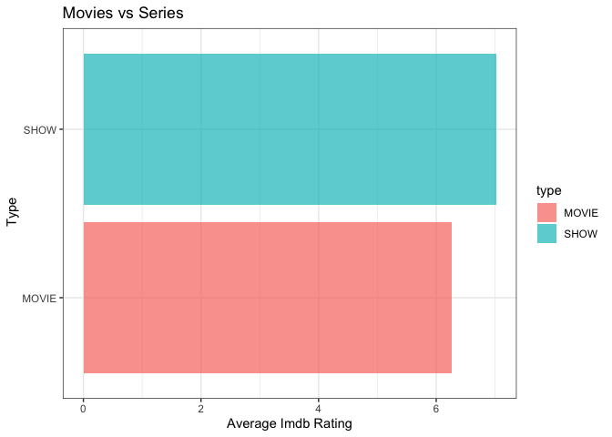

``` r
rm(list = ls()) # Clean your environment:
gc() # garbage collection - It can be useful to call gc after a large object has been removed, as this may prompt R to return memory to the operating system.
library(tidyverse)
```

# Question 1

``` r
if(!require("tidyverse")) install.packages("tidyverse")
library(tidyverse)


Loc <- "Question1/data/Covid/"
Covid1 <- read_csv(glue::glue("{Loc}owid-covid-data.csv"))
list.files('Question1/code/', full.names = T, recursive = T) %>% .[grepl('.R', .)] %>% as.list() %>% walk(~source(.))

l <- line_bar(alpha = 0.8, size = 1,fig.width=6, fig.height=4)
```

With regards to see differing trends between Africa and other countries

# Question 2

``` r
if(!require("tidyverse")) install.packages("tidyverse")
library(tidyverse)


Loc1 <- "Question2/data/London/"
London <- read_csv(glue::glue("{Loc1}london_weather.csv"))
UKMonthly_Detailed <- read_csv("~/21641412_Practical/Question2/data/London/UKMonthly_Detailed.csv")
list.files('Question2/code/', full.names = T, recursive = T) %>% .[grepl('.R', .)] %>% as.list() %>% walk(~source(.))
```

er4f f4ff4

# Question 3

``` r
if(!require("tidyverse")) install.packages("tidyverse")
library(tidyverse)


Loc2 <- "Question3/data/Coldplay_vs_Metallica/"
Spotify_info <- read_csv(glue::glue("{Loc2}Broader_Spotify_Info.csv"))
Coldplay <- read_csv(glue::glue("{Loc2}Coldplay.csv"))
metallica <- read_csv(glue::glue("{Loc2}metallica.csv"))
```

here is the barplot

``` r
library(tidyverse)
```

    ## ── Attaching packages ─────────────────────────────────────── tidyverse 1.3.1 ──

    ## ✔ ggplot2 3.4.0     ✔ purrr   1.0.1
    ## ✔ tibble  3.2.1     ✔ dplyr   1.1.2
    ## ✔ tidyr   1.3.0     ✔ stringr 1.5.0
    ## ✔ readr   2.1.4     ✔ forcats 0.5.1

    ## ── Conflicts ────────────────────────────────────────── tidyverse_conflicts() ──
    ## ✖ dplyr::filter() masks stats::filter()
    ## ✖ dplyr::lag()    masks stats::lag()

``` r
Loc2 <- "Question3/data/Coldplay_vs_Metallica/"
metallica <- read_csv(glue::glue("{Loc2}metallica.csv"))
```

    ## Rows: 1468 Columns: 14

    ## ── Column specification ────────────────────────────────────────────────────────
    ## Delimiter: ","
    ## chr   (2): name, album
    ## dbl  (11): duration_ms, popularity, danceability, energy, loudness, speechin...
    ## date  (1): release_date
    ## 
    ## ℹ Use `spec()` to retrieve the full column specification for this data.
    ## ℹ Specify the column types or set `show_col_types = FALSE` to quiet this message.

``` r
list.files('Question3/code/', full.names = T, recursive = T) %>% .[grepl('.R', .)] %>% as.list() %>% walk(~source(.))
f <- geom_bar1(alpha = 0.7, fig.width=6, fig.height= 20)
```

 The
following is found here

# Question 4

``` r
Loc3 <- "Question4/data/netflix/"
credit<- read_csv(glue::glue("{Loc3}credits.csv"))
titles <- read_csv(glue::glue("{Loc3}titles.csv"))

list.files('Question4/code/', full.names = T, recursive = T) %>% .[grepl('.R', .)] %>% as.list() %>% walk(~source(.))

m <- Movie_vs_series(alpha = 0.7)
m
```

This is why the following

``` r
Loc3 <- "Question4/data/netflix/"
credit<- read_csv(glue::glue("{Loc3}credits.csv"))
```

    ## Rows: 77213 Columns: 5
    ## ── Column specification ────────────────────────────────────────────────────────
    ## Delimiter: ","
    ## chr (4): id, name, character, role
    ## dbl (1): person_id
    ## 
    ## ℹ Use `spec()` to retrieve the full column specification for this data.
    ## ℹ Specify the column types or set `show_col_types = FALSE` to quiet this message.

``` r
titles <- read_csv(glue::glue("{Loc3}titles.csv"))
```

    ## Rows: 5806 Columns: 15
    ## ── Column specification ────────────────────────────────────────────────────────
    ## Delimiter: ","
    ## chr (8): id, title, type, description, age_certification, genres, production...
    ## dbl (7): release_year, runtime, seasons, imdb_score, imdb_votes, tmdb_popula...
    ## 
    ## ℹ Use `spec()` to retrieve the full column specification for this data.
    ## ℹ Specify the column types or set `show_col_types = FALSE` to quiet this message.

``` r
list.files('Question4/code/', full.names = T, recursive = T) %>% .[grepl('.R', .)] %>% as.list() %>% walk(~source(.))

m2 <- table_of_extremes()
m2
```

    ##                Movies   Show    
    ## Above 7 rating 23.25086 49.53591
    ## Below 5 rating 10.18888 0

To extrapolate further on the possible benefit of focusing on shows as
oppose to movies is displayed in the table above. Filtering the
dataframe into only movies and shows respectively allows one to get the
percewntage of movies above a rating of 7 and below a rating of 5 (the
same for shows). This illustrates that shows exhibit an imdb rating of
higher than 7 almost 50% of the time. Furthermore, there are no show
with a rating under 5. Movies are typically more hit and miss.

Future analysis to be done could be to weigh how this obvious pro for
Shows relates to costs for producing shows vs movies (given shows are
longer one would expect a bigger budget required). This insight could
ultimately decide what to put more focus on.

# Question 5

``` r
if(!require("tidyverse")) install.packages("tidyverse")
library(tidyverse)


Loc4 <- "Question5/data/googleplay/"
User_reviews<- read_csv(glue::glue("{Loc4}googleplaystore_user_reviews.csv"))
google_playstore <- read_csv(glue::glue("{Loc4}googleplaystore.csv"))
```

First I made use of Geom_col in order to extract the most profitable
apps from different categories

``` r
if(!require("tidyverse")) install.packages("tidyverse")
library(tidyverse)


Loc4 <- "Question5/data/googleplay/"
User_reviews<- read_csv(glue::glue("{Loc4}googleplaystore_user_reviews.csv"))
```

    ## Rows: 64295 Columns: 5
    ## ── Column specification ────────────────────────────────────────────────────────
    ## Delimiter: ","
    ## chr (3): App, Translated_Review, Sentiment
    ## dbl (2): Sentiment_Polarity, Sentiment_Subjectivity
    ## 
    ## ℹ Use `spec()` to retrieve the full column specification for this data.
    ## ℹ Specify the column types or set `show_col_types = FALSE` to quiet this message.

``` r
google_playstore <- read_csv(glue::glue("{Loc4}googleplaystore.csv"))
```

    ## Rows: 10054 Columns: 13
    ## ── Column specification ────────────────────────────────────────────────────────
    ## Delimiter: ","
    ## chr (11): App, Category, Size, Installs, Type, Price, Content Rating, Genres...
    ## dbl  (2): Rating, Reviews
    ## 
    ## ℹ Use `spec()` to retrieve the full column specification for this data.
    ## ℹ Specify the column types or set `show_col_types = FALSE` to quiet this message.

``` r
list.files('Question5/code/', full.names = T, recursive = T) %>% .[grepl('.R', .)] %>% as.list() %>% walk(~source(.))

g <- profitability(alpha = 0.7)
```

 Here I
made use of the geom_col function to look at the most profitable
categories of apps.

``` r
list.files('Question5/code/', full.names = T, recursive = T) %>% .[grepl('.R', .)] %>% as.list() %>% walk(~source(.))

f <- size_summary(ignore.case = TRUE)
```

    ## # A tibble: 10 × 4
    ##    Category            avg_Size min_Size  max_Size
    ##    <chr>                  <dbl>    <dbl>     <dbl>
    ##  1 GAME               41188807.      1.1 100000000
    ##  2 FAMILY             25976275.      1   100000000
    ##  3 TRAVEL_AND_LOCAL   23028605.      1.9  90000000
    ##  4 SPORTS             22582327.      1.1 100000000
    ##  5 ENTERTAINMENT      21492959.      3.3  78000000
    ##  6 PARENTING          20111114.      1.5  98000000
    ##  7 FOOD_AND_DRINK     19377779.      1.7  76000000
    ##  8 HEALTH_AND_FITNESS 19239500.      1.2 100000000
    ##  9 EDUCATION          18066837.      1.2  97000000
    ## 10 AUTO_AND_VEHICLES  17921149.      1.1  97000000

Here we looked at the average size, minimum size and maximum size of the
apps given for the given categories. They are also rank ordered from
highest to lowest average size
